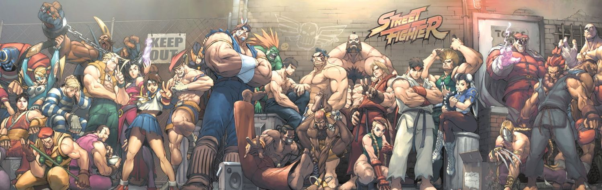

<h2> Street Fighter Game Card</h2>

## Sobre o Projeto

O projeto tem como objetivo criar um jogo baseado no clássico jogo de cartas [Super trunfos](https://en.wikipedia.org/wiki/Top_Trumps), onde os jogadores usam cartas temáticas ilustradas e comparam seus atributos para descobrir quem venceria em cada critério, aqui neste caso o tema utilizado é o do popular jogo [Street Fighter](https://www.streetfighter.com/6/pt-br), onde as cartas são baseadas em seus respectivos personagens.

---
 

 

⚙ O desenvolvimento de software é uma arte em constante evolução - nunca se contente com o suficiente. ⚙

